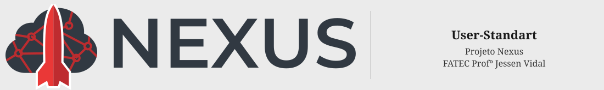

<br />
<span id="User-Standart"></span>

# <p align="center">User-Standart</p>

<p align="center">
    <a href="#challenge">Challenge</a>  |  
    <a href="#solution">Solution</a>  |   
    <a href="#product-backlog">Product Backlog</a>  |  
    <a href="#dor">DoR</a>  |  
    <a href="#dod">DoD</a>  |  
    <a href="#sprint-schedule">Sprint Schedule</a>  |  
    <a href="#technologies">Technologies</a> | 
    <a href="#getting-started">Getting Started</a> | 
    <a href="#api-documentation">API Documentation</a> | 
    <a href="#database-modeling">Database Modeling</a> | 
    <a href="#team">Team</a> |
    <a href="#project-guidelines">Project Guidelines</a>
</p>

> Project Status: **In Development 🚧** <br /><br />
> Documentation Folder: [Link](https://github.com/User-Standart/API-5SEM/tree/main/docs) 📄 <br /><br />

---

<span id="challenge"></span>

# 🏅 Challenge

**SIATT** manages complex strategic projects spanning multiple organizational domains, including engineering, materials procurement, technical hour tracking, and institutional program oversight.

Currently, operational data is fragmented across disparate systems and records, hindering integrated analysis and limiting visibility into project performance.

The core challenge of this initiative is to **integrate, structure, and analyze strategic project data**, providing managers with a consolidated view of resource consumption, activity progress, and the operational history of company programs.

---

<span id="solution"></span>

# 🏅 Solution

The proposed solution is an **analytical platform for data integration and exploration**, designed to consolidate information from across the organization into a single, unified environment.

The system will enable:

- Seamless integration of operational data from multiple sources
- Structured data modeling to support reliable analysis
- Historical visualization of project evolution over time
- Actionable insights to support strategic decision-making

The goal is to transform fragmented, scattered data into **structured and accessible intelligence**, enabling more efficient and informed management of strategic programs and projects.

→ [Back to top](#User-Standart)

---

## 📋 Functional Requirements

| ID | Functional Requirement | Description |
|----|------------------------|-------------|
| RF01 | ETL & Data Quality, DW | The system must collect and consolidate data from multiple sources — including spreadsheets and CSV files — standardizing project identifiers and organizing all information into a unified database. |
| RF02 | Data Validation and Cleaning | The system must detect inconsistencies in imported data and apply validation and correction procedures to ensure data quality prior to visualization. |
| RF03 | Project Cost Visualization | The system must display the total cost of each project through dashboards, enabling managers to identify projects exceeding expected resource consumption. |
| RF04 | Delay Risk Indicator | The system must surface projects at risk of delay using visual indicators and dashboards, supporting faster and more informed managerial decisions. |
| RF05 | Cost vs. Execution Dashboard | The system must present a comparative dashboard correlating project cost with execution progress to evaluate overall project performance. |
| RF06 | Investment by Program | The system must display total investment grouped by program, enabling strategic analysis of resource distribution across the organization. |
| RF07 | Material Consumption by Project | The system must display material consumption broken down by project, using charts or tables to illustrate how resources are being allocated and used. |
| RF08 | Time Spent by Task and Project | The system must display the time logged per task and project, enabling productivity and effort analysis. |
| RF09 | Analytical Filters | The system must support dashboard filtering by program, project, task, material, order, and time period to facilitate multi-level analysis. |
| RF10 | Quick Search | The system must provide a quick search capability for projects, materials, and suppliers, allowing users to locate specific information with minimal effort. |
| RF11 | Data Export | The system must support exporting dashboards and reports in formats such as CSV and PDF, facilitating the sharing of results in meetings and presentations. |
| RF12 | Data Visualization Dashboards | The system must provide analytical dashboards featuring charts and tables for consolidated visualization of project data. |

## 📋 Non-Functional Requirements

| ID | Non-Functional Requirement | Description |
|----|----------------------------|-------------|
| RNF01 | API Documentation | The system must provide clear, comprehensive documentation for all API endpoints used to access consolidated data. |
| RNF02 | Responsiveness | All dashboards and visualization panels must be fully responsive and accessible across different devices, including desktop and mobile. |
| RNF03 | User Manual | The system must include a user manual guiding users through key features, with step-by-step tutorials, usage tips, and common troubleshooting guidance. |
| RNF04 | Data Quality | The system must ensure data integrity and consistency through robust validation and transformation procedures during the ETL process. |
| RNF05 | Data Warehouse Modeling | The system must implement a well-structured data model (Data Warehouse) capable of efficiently supporting analytical queries and dashboards. |
| RNF06 | Performance | The system must deliver fast access to analytical dashboards and queries, even when operating over large datasets. |

---

<span id="product-backlog"></span>

## 🧵 Product Backlog

### 📋 Requirement Packages Legend

| Package | Covered Requirements |
|---------|----------------------|
| *ETL & Data Quality* | RF01, RF02 |
| *Dashboards* | RF03, RF04, RF05 |
| *Analytics* | RF06, RF07, RF08 |
| *Filters & Search* | RF09, RF10 |
| *Export* | RF11 |
| *DW* | RNF01, RNF02 |
| *Docs & UX* | RNF03, RNF04, RNF05 |

---

### ✅ Backlog Items Table

| Rank | Requirement Packages | User Story | Role | Priority | Sprint | Status | DoR (Definition of Ready) | DoD (Definition of Done) |
|------|----------------------|------------|------|----------|--------|--------|---------------------------|---------------------------|
| 1 | ETL & Data Quality, DW | As a User, I want to collect and organize data from different systems and spreadsheets so that I can view all information in a single, unified place. | User | 1 | 1 | 🔄 In Progress | Data sources identified; data structure defined; ETL requirements documented. | Data integrated into the DW; ETL process implemented; data validated and documented. |
| 2 | Dashboards, Docs & UX | As a User, I want to visualize the total cost of each project so that I can identify which ones are consuming more resources than planned. | User | 1 | 1 | 🔄 In Progress | Project cost data available; dashboard layout defined; metrics specified. | Dashboard displaying total cost per project implemented and validated. |
| 3 | Dashboards | As a User, I want to visualize projects at risk of delay so that I can take corrective action quickly. | User | 1 | 1 | 🔄 In Progress | Delay risk criteria defined; project timeline data available. | Dashboard highlights at-risk projects; risk indicators validated. |
| 4 | Dashboards, Analytics | As a User, I want to visualize dashboards correlating project cost and execution progress so that I can evaluate overall project performance. | User | 2 | 1 | 🔄 In Progress | Cost and execution data available; visualization requirements defined. | Cost vs. execution dashboard implemented and tested. |
| 5 | Analytics | As a User, I want to visualize which program concentrates the highest investment so that I can support strategic resource allocation decisions. | User | 2 | 2 | ⏳ To Do | Investment data per program available; analysis requirements defined. | Investment-by-program visualization implemented and validated. |
| 6 | Analytics | As a User, I want to visualize material consumption per project so that I can understand how resources are being utilized. | User | 2 | 2 | ⏳ To Do | Material usage data available; project relationship defined. | Material consumption dashboard implemented per project. |
| 7 | Analytics | As a User, I want to visualize time spent per task and project so that I can evaluate team effort and productivity. | User | 2 | 2 | ⏳ To Do | Task and time tracking data available; metrics defined. | Time-spent dashboard per task and project implemented and validated. |
| 8 | Filters & Search | As a User, I want to filter dashboards by program, project, task, material, order, and period so that I can perform multi-level analysis with precision. | User | 2 | 2 | ⏳ To Do | Filter fields defined; dataset prepared for filtering. | Interactive filters implemented and functioning across all dashboards. |
| 9 | Filters & Search | As a User, I want to quickly search for projects, materials, and suppliers so that I can locate specific information with minimal effort. | User | 3 | 2 | ⏳ To Do | Search fields defined; indexing strategy established. | Search functionality implemented and returning accurate results. |
| 10 | Export, Docs & UX | As a User, I want to export reports and dashboards so that I can share results effectively in meetings and presentations. | User | 3 | 3 | ⏳ To Do | Export formats defined; data prepared for export. | Export feature implemented and generating correct files (PDF/CSV). |

---

<span id="dor"></span>

# 🏃‍♂️ DoR — Definition of Ready

- User stories with defined acceptance criteria
- Subtasks identified and assigned
- UI/UX design defined
- Database modeling completed
- System architecture defined
- Sprint planning conducted

---

<span id="dod"></span>

# 🏆 DoD — Definition of Done

- Code implemented and reviewed
- Tests executed and passing
- Documentation updated
- API documentation completed
- Sprint delivery presentation recorded

→ [Back to top](#User-Standart)

---

<span id="sprint-schedule"></span>

# 📅 Sprint Schedule

| Sprint | Period | History |
|--------|--------|---------|
| Sprint 1 | 03/16 – 04/05 | [Sprint 1 Docs](https://github.com/User-Standart/API-5SEM/tree/main/docs) |
| Sprint 2 | 04/13 – 05/03 | [Sprint 2 Docs](https://github.com/User-Standart/API-5SEM/tree/main/docs) |
| Sprint 3 | 05/11 – 05/31 | [Sprint 3 Docs](https://github.com/User-Standart/API-5SEM/tree/main/docs) |

→ [Back to top](#User-Standart)

---

<span id="technologies"></span>

# 💻 Technologies

<p align="center">


</p>

→ [Back to top](#User-Standart)

---

<span id="getting-started"></span>

# 🚀 Getting Started

### Prerequisites

- [Git](https://git-scm.com/)
- [Docker](https://www.docker.com/) and [Docker Compose](https://docs.docker.com/compose/)

### 1. Clone the repository with submodules

```bash
git clone --recurse-submodules https://github.com/User-Standart/API-5SEM.git
cd API-5SEM
```

> **Already cloned without `--recurse-submodules`?** Run the command below to initialize the submodules:
>
> ```bash
> git submodule update --init --recursive
> ```

### 2. Configure the submodules to track their remote branches

By default, submodules are checked out in a detached HEAD state. To work on them as actual repositories (create branches, commit, push, etc.), run the following inside each submodule:

```bash
cd API-5SEM-BACKEND
git checkout main
cd ..

cd API-5SEM-ETL
git checkout main
cd ..

cd API-5SEM-FRONTEND
git checkout main
cd ..
```

### 3. Set up environment variables

Copy the example file and adjust values if needed:

```bash
cp .env.example .env
```

The default `.env.example` contains:

```env
# PostgreSQL
POSTGRES_USER=appdb
POSTGRES_PASSWORD=appdb
POSTGRES_DB=appdb

# Backend
PORT=8080
DATABASE_URL=postgres://appdb:appdb@db:5432/appdb?sslmode=disable

# Frontend
BACKEND_PATH=http://backend:8080
```

### 4. Start the application

```bash
docker compose up --build
```

This will start all services:

| Service | URL | Description |
|---------|-----|-------------|
| **Frontend** | http://localhost:3000 | Nuxt 3 application (hot-reload enabled) |
| **Backend** | http://localhost:8080 | Go REST API |
| **Database** | localhost:5433 | PostgreSQL 17 (mapped to port 5433 to avoid conflicts) |
| **ETL** | — | Python pipeline (runs and exits) |

### 5. Stop the application

```bash
docker compose down
```

To also remove the database volume (reset all data):

```bash
docker compose down -v
```

### Pulling submodule updates

To pull the latest changes from all submodules:

```bash
git submodule update --remote --merge
```

→ [Back to top](#User-Standart)

---

<span id="api-documentation"></span>

# 📓 API Documentation

🚧 Under construction

→ [Back to top](#User-Standart)

---

<span id="database-modeling"></span>

# 🖥️ Database Modeling

[Relational Model](https://github.com/User-Standart/API-5SEM-ETL/blob/main/docs/modelo_relacional.png)

→ [Back to top](#User-Standart)

---

<span id="team"></span>

# 👥 Team

<div align="center">

| Role | Name | LinkedIn & GitHub |
|------|------|-------------------|
| Product Owner | Beatriz Sthefanny | [LinkedIn](https://www.linkedin.com/in/beatriz-santos-0b6773220/) · [GitHub](https://github.com/BeatrizSantos00) |
| Scrum Master | Caio Osorio | [LinkedIn](https://www.linkedin.com/in/caio-o-a67224200/) · [GitHub](https://github.com/User-Business) |
| Developer | Tiago Bernardo | [LinkedIn](https://www.linkedin.com/in/tiagobernardosantos/) · [GitHub](https://github.com/TiagoBernardoSantos) |
| Developer | Victor Ryan | [LinkedIn](https://www.linkedin.com/in/victor-ryan-51738b261) · [GitHub](https://github.com/yzvictorr) |
| Developer | Ali Mohamed Khodr | [LinkedIn](https://www.linkedin.com/in/alimohamedkhodr/) · [GitHub](https://github.com/alimkhodr) |
| Developer | Aline Ramos | [LinkedIn](https://www.linkedin.com/in/aline-ramos-3186b130/) · [GitHub](https://github.com/allineramos) |
| Developer | João Paulista | [LinkedIn](https://www.linkedin.com/in/joaopaulista/) · [GitHub](https://github.com/joaopaulista) |

</div>

→ [Back to top](#User-Standart)

---

<span id="project-guidelines"></span>

# 📜 Project Guidelines

<details>
<summary>Click to expand — Project Rules and Commit Standard</summary>

## 👥 Team Participation Rules

- A maximum of **1 absence per month** is allowed for weekly meetings held on Thursdays
- All members must respect deadlines and adhere to the **commit standard**
- Difficulties must be communicated proactively to avoid last-minute issues before final presentations
- Every team member is expected to **present at least one sprint**

---

## 📌 Commit Standard

All commits must follow the **"Commit Pattern – by Renato Adorno"** to ensure consistency and clarity across the repository.

### Commit Format

    <type>: <description in English>

The description must:
- Be written in **English**
- Use a **direct, imperative tone**
- Be **clear and concise**

---

### 🧩 Commit Types

- **fix** – Fixes a bug
- **feat** – Introduces a new feature
- **docs** – Documentation-only changes
- **style** – Code formatting changes with no logic impact
- **refactor** – Code improvements that do not alter behavior
- **build** – Changes to the build system or dependencies
- **test** – Adding or updating tests
- **chore** – Routine maintenance tasks

---

### ✅ Examples

    feat: add analytical filters to dashboard endpoints
    docs: translate README to English
    fix: correct date filter logic
    refactor: improve data processing performance
    test: add unit tests for filter component

---

### ⚠️ Rules

- Always write commits in **English**
- Strictly follow the defined **commit types**
- Avoid vague or uninformative messages such as:
  - `update`
  - `fix stuff`

Always prefer descriptive, actionable messages such as:

    fix: correct null pointer exception in service layer

</details>

→ [Back to top](#User-Standart)
